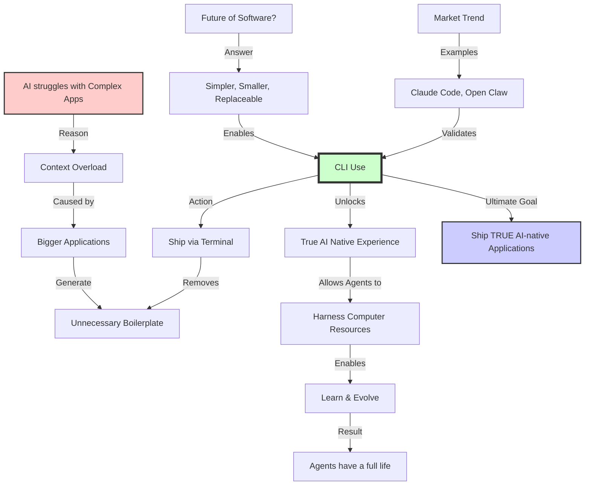
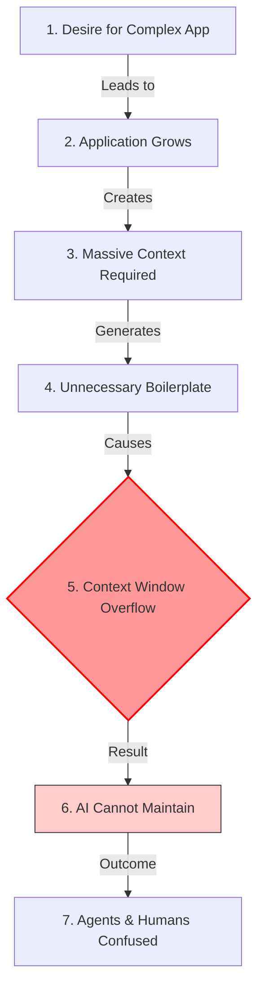
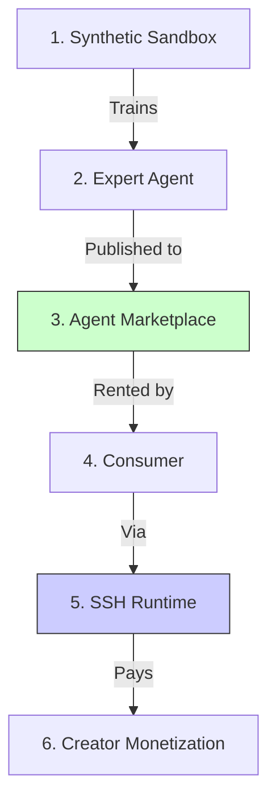

# cli-use


> Easily build agentic CLI tools

**cli-use** is a powerful framework for building stunning terminal applications. It combines the ease of **React** for standard TUIs with a high-performance **Native Rust/Ratatui** engine for advanced, AI-powered interfaces.

## 🎯 Overview

- **React**: Build interactive CLIs using React components (Tables, Lists, Markdown, Flexbox).
- **Rust/Ratatui**: Experience ultra-fast, native TUI performance for specialized tools like our AI terminal.

## ✨ Features

- **🤖 AI-Powered Terminal** - Integrated Google Gemini AI chat client (Native Rust).
- **🎨 Beautiful Styling** - CSS-like properties for stunning interfaces.
- **📊 Rich Components** - Tables, Lists, Markdown, and Layouts out of the box.
- **⚡ Hybrid Architecture** - Uses Node.js for flexibility and Rust for raw TUI performance.
- **🔧 TypeScript** - Full type safety and excellent IDE support.

## 🚀 Quick Start

### 1. Install via NPM

```bash
npm install -g @cli-use/tui
```

### 2. Configure AI (Optional)

To use the AI features (`cli-use code`), you need to set your Google Gemini API key.

1.  Get a [Google AI Studio API Key](https://aistudio.google.com/app/apikey).
2.  Set it in your environment:

```bash
# Set in your current session
export GOOGLE_API_KEY=your_key_here

# OR create a .env file in the directory where you run the command
echo "GOOGLE_API_KEY=your_key_here" > .env

# OR create a global config file in your home directory (Recommended)
echo "GOOGLE_API_KEY=your_key_here" > ~/.cli-use-env
```

### 3. Run the AI Terminal

Launch the high-performance AI chat interface:

```bash
cli-use code
```

## 🤖 CLI CODE (AI Terminal)

The `cli-use code` command launches a native Rust application that integrates with **Google Gemini**.

- **Splash Screen**: Instant startup with a stylized "CLI CODE" ASCII art.
- **Instant Input**: Start typing your query immediately on the home screen.
- **Streaming Responses**: Real-time AI streaming powered by Vercel AI SDK (Node.js) and Ratatui (Rust).
- **Performance**: Zero-latency UI rendering thanks to the native Rust backend.

**Prerequisites for Native Features:**

- [Rust installed](https://rustup.rs/) (automatically detected and built during install).

## 💡 React Examples

You can also build standard React-based CLIs.

### Basic App

```tsx
import React from 'react';
import { render, Box, Text } from '@cli-use/tui';

const App = () => (
  <Box borderStyle="round" padding={1}>
    <Text bold>Hello from cli-use!</Text>
  </Box>
);

render(<App />);
```

### Interactive Counter

```tsx
import React, { useState } from 'react';
import { render, Box, Text, useInput } from '@cli-use/tui';

const Counter = () => {
  const [count, setCount] = useState(0);

  useInput((input, key) => {
    if (key.return) setCount((c) => c + 1);
  });

  return (
    <Box>
      <Text>Count: {count}</Text>
      <Text dim>Press Enter to increment</Text>
    </Box>
  );
};

render(<Counter />);
```

## 📦 API

### Core Components

- **`Box`** - Container component for layout and styling
- **`Text`** - Text rendering with colors and styles
- **`render()`** - Render cli-use apps to terminal
- **`useInput()`** - Handle keyboard input
- **`useApp()`** - App instance management

## 🧰 Development

```bash
# Install dependencies
npm install

# Build the project (including Rust native binary)
npm run build

# Run the AI Terminal (Dev Mode)
npm run demo:rust

# Run React Examples
npm run demo:cli-use
```

## 📁 Project Structure

```
cli-use/
├── native/              # Rust/Ratatui source code
│   └── src/
│       └── main.rs      # Native TUI entry point
├── src/
│   ├── ai-worker.ts     # Node.js AI Bridge (Vercel AI SDK)
│   ├── cli/             # CLI Entry point
│   ├── components/      # React components
│   └── examples/        # Example apps
│       └── cli-use-demo.tsx # React/cli-use Demo
├── package.json
└── README.md
```

## 🧠 Philosophy & Strategy

`cli-use` is not just a framework; it's a movement towards **Agent-First Software**.
We believe the future of AI is not in chat windows, but in specialized, interactive CLI agents distributed instantly via SSH.

- 📖 **[Read the Manifesto](docs/PHILOSOPHY.md)**: Why software must be instant, ephemeral, and terminal-native.
- 📊 **[Market Analysis](docs/MARKET_ANALYSIS.md)**: Why we are building the "Agent Economy" and the "Steam for AI Agents".
- ⚔️ **[Competitive Analysis](docs/COMPETITIVE_ANALYSIS.md)**: How we win against Replit, Lovable, and LangChain.

### The Vision



### The Context Problem



### The Agent Economy



## 🤝 Contributing

Contributions welcome! Please read our contributing guidelines before submitting PRs.

## 📄 License

MIT © 2025 cli-use contributors

---

**Built with ❤️, React, and Rust**
