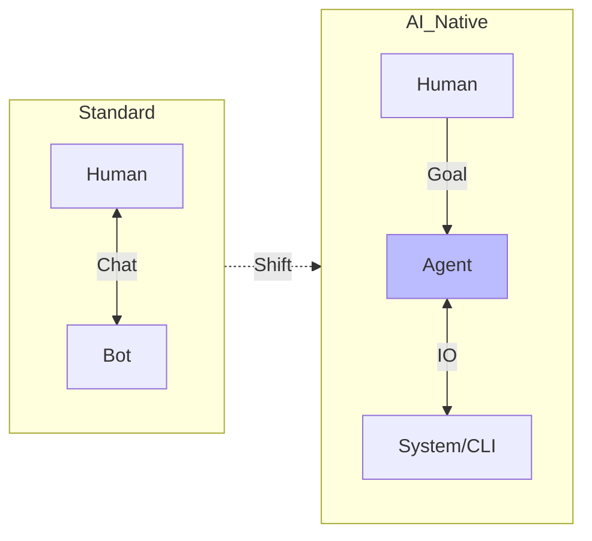
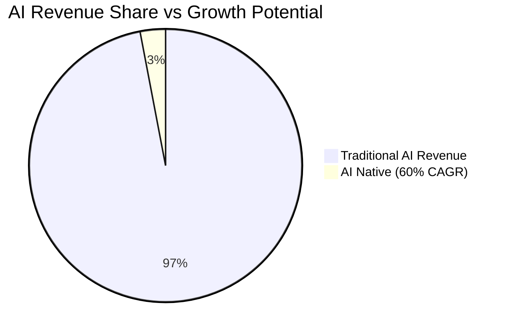
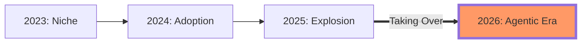
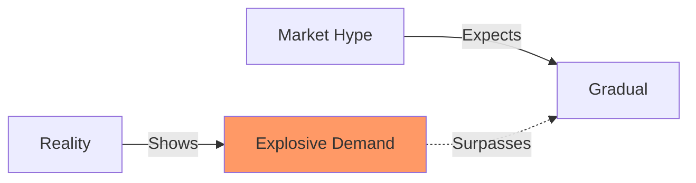
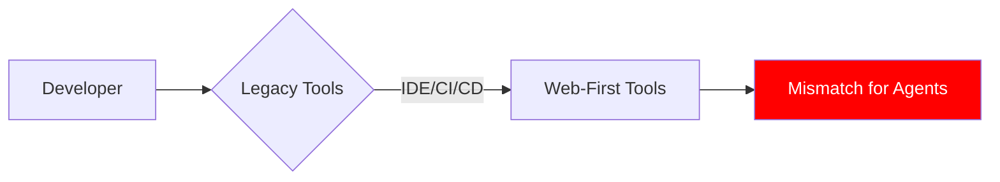
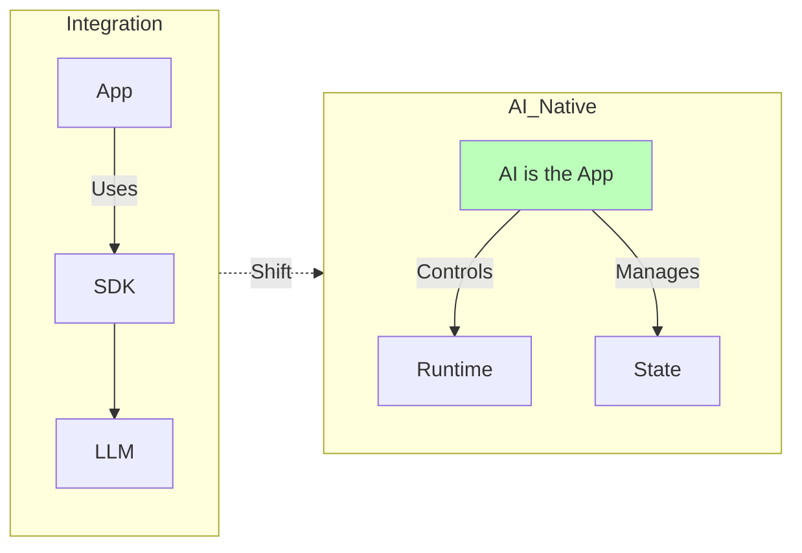
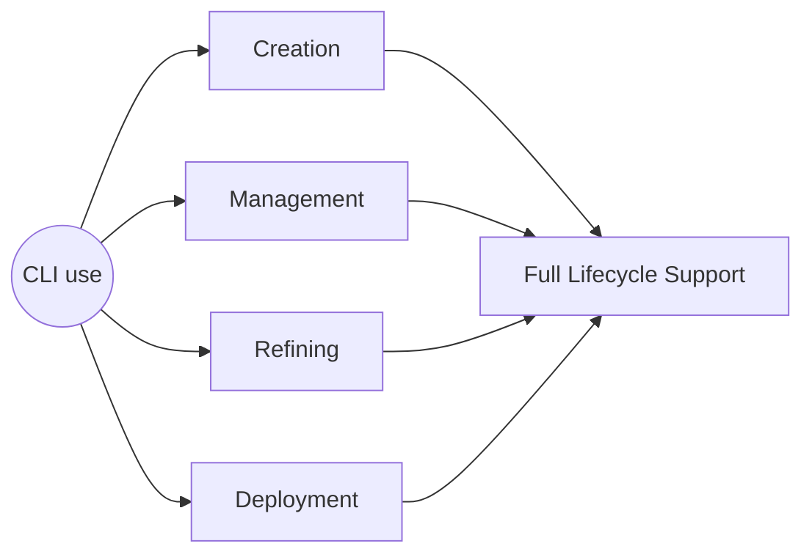
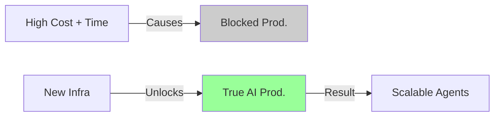

# 🚀 The Agentic Shift: Infrastructure for the AI Native Era

## 🔄 From Orchestration to Native Execution

### 🧠 AI Native Apps

That's one of the fastest growing areas in AI, with a 60% CAGR, but still only represents (3%) of AI's revenue.

---

## 📈 Unexpected Success & The Tooling Gap

But AI native tools are an unexpected success.

And it means that we don't have any custom tools for it yet.

---

## 🛠️ The Integration vs. Creation Dilemma

Current products like langchain, promptfoo, AI sdks are focused on integrating AI into application, not creating AI native tools.

## ⚡ Introducing CLI use: The Ecosystem

And that's what I'm building at CLI use. Tools for creation, management, refining and deployment of these applications.

---

## ⚡ Introducing CLI use: The Ecosystem

And that's what I'm building at CLI use. Tools for creation, management, refining and deployment of these applications.

---

## 🔓 Unlocking True Productivity

It ends up costing a lot of money, time and efficiency. Real AI productivity will only be unlocked when we have the proper infrastructure and tools to deal with that.

---

## ⏳ The Perfect Timing

I'm building it to solve my personal problems, and trust me, there's an infinite amount of work to do. People have not yet seen what AI is capable of and we're in a perfect timing for it.
